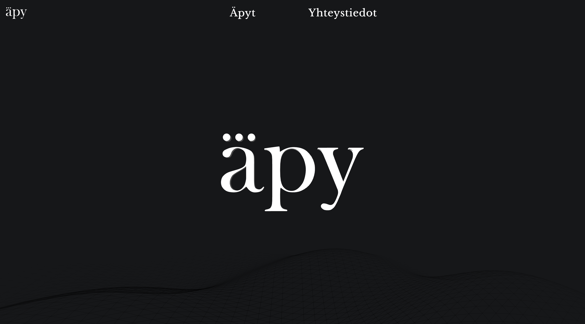
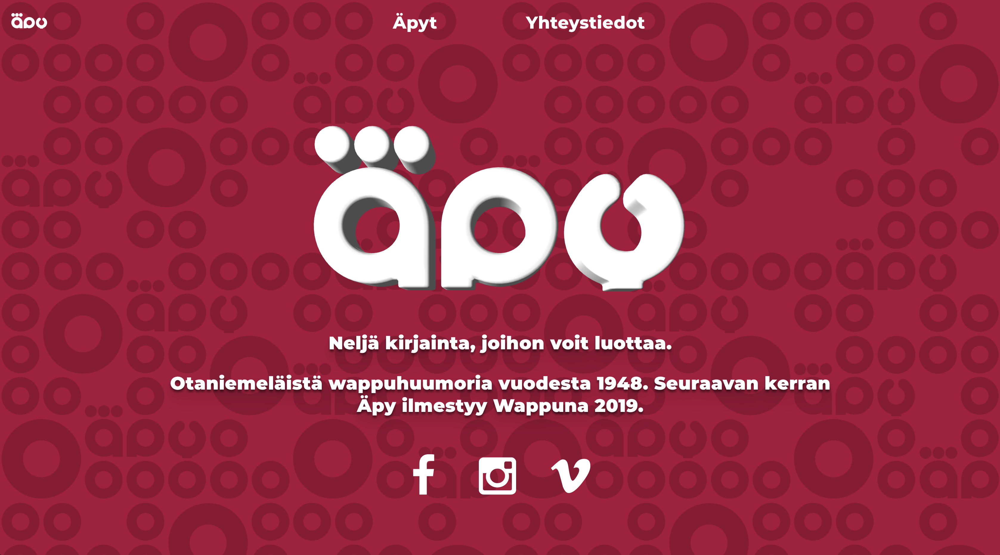

# Äpy.fi

Wappulehti Äpyn verkkosivut.

## Kehittäminen

Alla ohjeet lokaaliajoon.

### Asennus

Paikallinen kehittäminen onnistuu seuraavilla komennoilla:

```
npm install
npm develop
```

### Koodityyli

Tiedostot .eslintrc ja .prettierrc sisältävät koodin tyylimäärittelyjä. Käytössä on [ESLint](https://eslint.org/) ja [Prettier](https://prettier.io/)

## Konfigurointi

Nettisivujen ilmettä on mahdollista muuttaa .env tiedoston muuttujien avulla. `GATSBY_THEME` muuttuja kontrolloi etusin logokomponenttia (<Logo /> vs <Logo2019 />) sekä modalin ja navbarin logoa.

Sivujen ulkonäkö eri `.env` tiedoston konfiguraatioilla:
```
# Used throughout different components to use a yearly logo/textures
THEME='ajaton'
# Supported values: 'logo', 'video', 'diilikone' or 'wappu'
INDEX_ELEMENT='video
```



```
# Used throughout different components to use a yearly logo/textures
THEME='2019'
# Supported values: 'logo', 'video', 'diilikone' or 'wappu'
INDEX_ELEMENT='video
```




## Käyttöönotto

Gatsby production build ja servaus

```
gatsby build && gatsby serve
```

## Rakennuspalikat

* [React](https://reactjs.org/) - Javascript UI-kirjasto
* [Gatsby](https://www.gatsbyjs.org/) - Generoi Reactin staattisia sivuja

## Kehittäjät

* Timo Riski

## Lisenssi

MIT lisenssi - [LICENSE](LICENSE).
